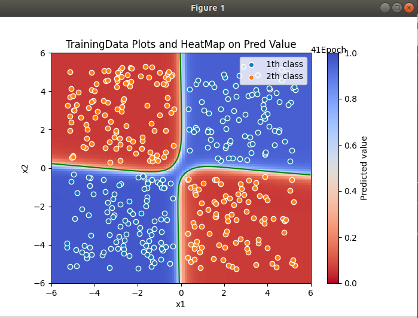

# myTF_GooglePlayGround

## Overview
This is a reproduction of the a Neural Network playground I created for practicing Keras.

## Usage
Enter the following command on your device (Terminal on Linux).
### python3 main.py

## An example of result by demo

## My environment
---OS---  
 * *ubuntu 18.04 LTS*

---Language---  
 * *Python 3.7.7*  
 
---Libraries---  
 * *numpy (== 1.18.2)*  

 * *plygdata (== 1.1.0)*  

 * *matplotlib (== 3.2.1)* 
 
  * *tensorflow(-gpu) (== 2.1.0)*
  
